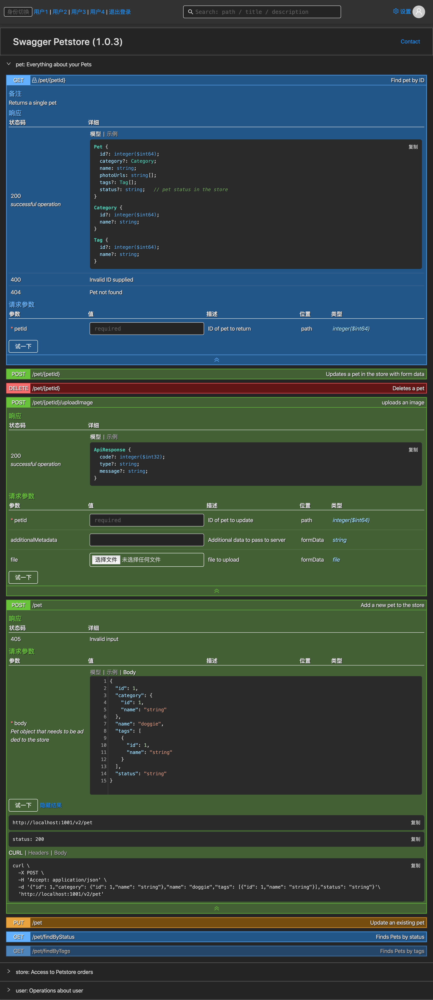
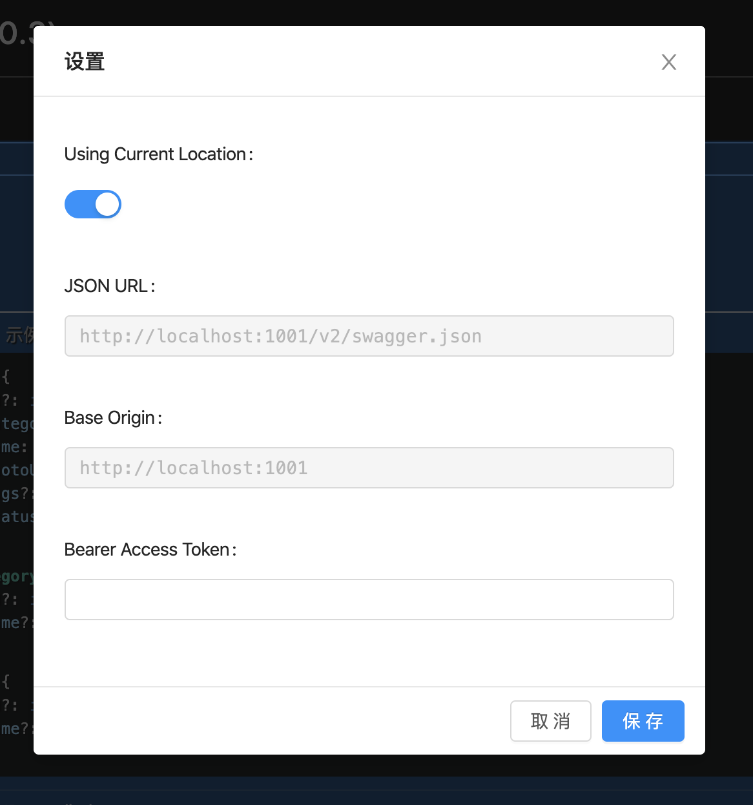

# swagger-ui

## Usage
### production or preview
``` bash
npm i && npm run build
docker build -t swagger-ui .
docker run -d -p 1001:80 swagger-ui # open http://localhost:1001
```
### screenshot



### custom in development
``` bash
 PROXY=https://petstore.swagger.io BASE_PATH=/v2 PORT=9001 npm run dev
```

If you are new to swagger and using nodejs, I recommend [swagger-jsdoc](https://www.npmjs.com/package/swagger-jsdoc) for convenient

## Todo
 - [ ] 配置设计
 - [x] 支持swagger 2.x
 - [ ] 支持swagger 3.x
 - [ ] 增强顶部搜索框
 - [ ] ts重构
 <!-- - [ ] 重构query定位 -->
